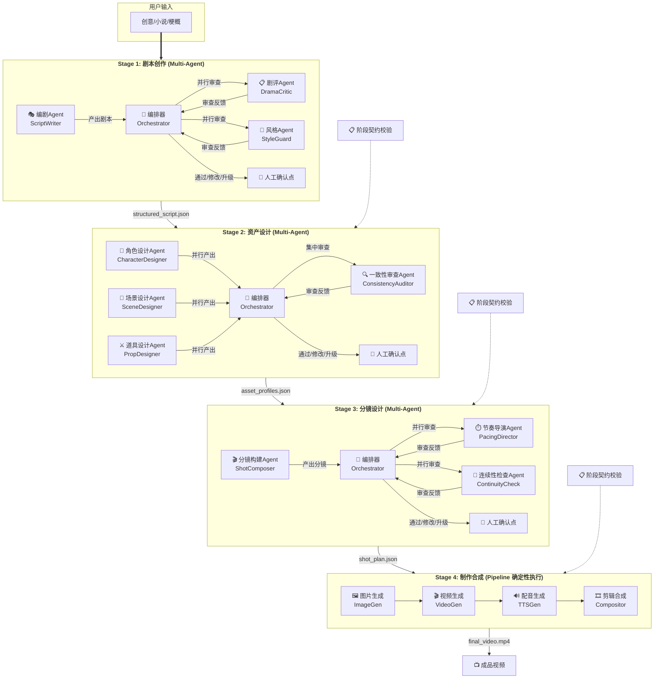
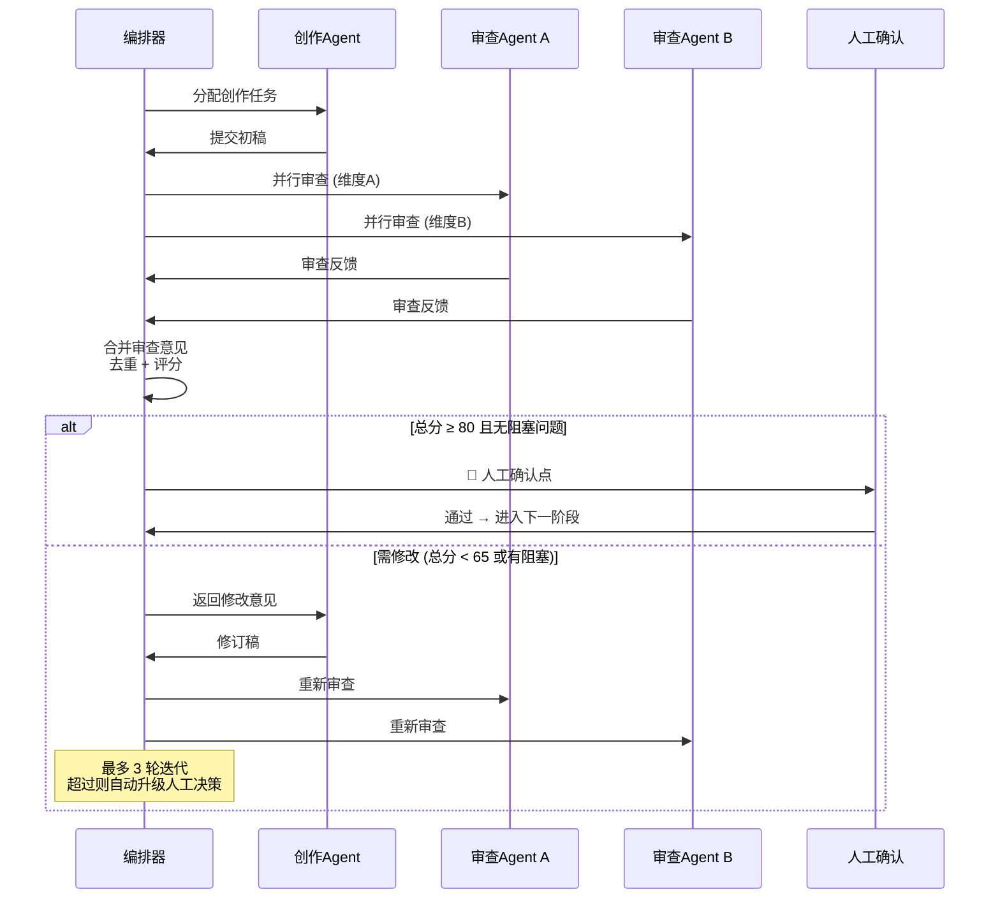
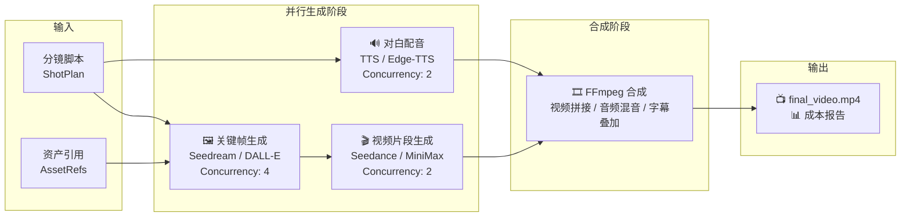

# AI 漫剧创作平台 (AI Comic Studio)

> 从剧本到成片的 **AI 全自动化创作管线**。四阶段流程，Multi-Agent 创意协作 + Pipeline 确定性制作，覆盖动漫短剧创作的完整生命周期。

---

## 整体架构



---

## Agent 协作流程详解

### 四阶段管线全景

```
用户输入                 Stage 1                  Stage 2                  Stage 3                  Stage 4
┌──────────┐         ┌──────────────┐         ┌──────────────┐         ┌──────────────┐         ┌──────────────┐
│ 创意/小说 │ ──────→ │  结构化剧本   │ ──────→ │  角色/场景    │ ──────→ │  分镜脚本    │ ──────→ │  成品视频    │
│ 梗概/大纲 │         │  (Script)    │         │  资产档案     │         │(Storyboard)  │         │(Production)  │
└──────────┘         └──────────────┘         └──────────────┘         └──────────────┘         └──────────────┘
                           │                         │                        │                       │
                    编剧 Agent              角色设计 Agent            分镜构建 Agent          图片生成 (并行)
                    剧评 Agent              场景设计 Agent            节奏导演 Agent          视频生成 (并行)
                    风格 Agent              道具设计 Agent            连续性检查 Agent         配音生成 (并行)
                                           一致性审查 Agent                                  剪辑合成
                           │                         │                        │                       │
                    Multi-Agent              Multi-Agent              Multi-Agent              Pipeline
                    创意协作                 创意协作                  创意协作                 确定性执行
```

### Stage 1-3：Multi-Agent 审查循环



### Stage 4：Pipeline 确定性执行



---

## 品控体系 (QC-5 五维质量模型)

每个 Stage 的产出从五个维度量化评分：

| 维度 | 定义 | Stage 1 权重 | Stage 2 权重 | Stage 3 权重 |
|------|------|:---------:|:---------:|:---------:|
| **完整性** | 产出是否覆盖所有必需要素 | 25% | 20% | 15% |
| **一致性** | 内部元素之间、与上游约定之间是否一致 | 15% | **40%** | 30% |
| **品质感** | 创意/审美/叙事层面的高度 | **35%** | 25% | 25% |
| **可执行性** | 下游阶段是否能直接使用 | 15% | 10% | **25%** |
| **合规性** | 是否遵守项目约束（时长/预算/风格） | 10% | 5% | 5% |

**评分规则**：总分 ≥ 80 且无阻塞 → 自动通过 | 65-79 → 人工快审 | < 65 → 必须修订 | 最多 3 轮迭代

---

## 数据全链路

```
  Stage 0                  Stage 1                  Stage 2                  Stage 3                  Stage 4
┌────────────┐         ┌────────────┐           ┌────────────┐           ┌────────────┐           ┌────────────┐
│ProjectInput│ ──────→ │  Script    │ ────────→ │  Assets    │ ────────→ │ Storyboard │ ────────→ │ Production │
│            │         │            │           │            │           │            │           │            │
│·source     │         │·episodes[] │           │·characters │           │·episodes[] │           │·videos[]   │
│·genre      │         │·scenes[]  │           │·locations  │           │·shots[]    │           │·task_log   │
│·target_spec│         │·character │           │·props[]    │           │·keyframes  │           │·cost_report│
│·style      │         │  _index   │           │·style_     │           │·dialogue   │           │            │
└────┬───────┘         │·location  │           │  manifest  │           │  _mapping  │           └────────────┘
     │                 │  _index   │           └─────┬──────┘           └─────┬──────┘
     │                 └─────┬──────┘                 │                       │
     ▼                       ▼                       ▼                       ▼
  creative_input.json   structured_script.json   asset_profiles.json    shot_plan.json
                                                                              │
                                                          ┌───────────────────┘
                                                          ▼
                                                    final_video.mp4
```

### 跨阶段连续性契约

每个阶段产出时自动校验跨阶段契约，防止"翻译损耗"：

- **S1→S2**：角色/场景/道具覆盖率、风格对齐、服装逻辑
- **S2→S3**：角色/服装/场景/道具引用验证、提示词注入检查、种子连续性
- **S3→S4**：提示词完整性、对白时间码合理性、时长合规、资源URL有效性

违规级别：`blocker`（阻塞下一阶段）→ `major`（需人工确认）→ `minor`（自动记录）

---

## 技术栈

### 后端
| 组件 | 技术 |
|------|------|
| Web 框架 | Python 3.12 + FastAPI |
| Agent 编排 | LangGraph (StateGraph) |
| 异步任务 | Celery + Redis |
| 数据库 | PostgreSQL (asyncpg) + SQLAlchemy 2.0 |
| 对象存储 | MinIO (S3-compatible) |
| 数据校验 | Pydantic v2 |

### 前端
| 组件 | 技术 |
|------|------|
| 框架 | React 19 + TypeScript (strict) |
| 构建 | Vite |
| 样式 | Tailwind CSS 4 |
| 组件库 | shadcn/ui |
| 状态管理 | Zustand |

### 视频/图片生成
| 类型 | 支持 Provider |
|------|-------------|
| 🖼️ 图片 | OpenAI DALL-E 3, Stable Diffusion, Hunyuan, Seedream |
| 🎬 视频 | Kling, Veo, Seedance, MiniMax (Hailuo) |
| 🔊 配音 | OpenAI TTS, Edge-TTS |

---

## 快速开始

```bash
# 克隆仓库
git clone https://github.com/fandongxu056-prog/ai-comic-studio.git
cd ai-comic-studio

# 配置环境变量
cp docker/.env.example docker/.env

# 启动全部服务
docker compose -f docker/docker-compose.yml up -d
```

| 服务 | 地址 |
|------|------|
| 🖥️ 前端页面 | http://localhost:5173 |
| 🔧 后端 API | http://localhost:8000 |
| 📖 Swagger 文档 | http://localhost:8000/docs |

---

## 项目结构

```
ai-comic-studio/
├── backend/                          # FastAPI 后端
│   ├── app/
│   │   ├── api/v1/                   # REST API 端点
│   │   │   ├── projects.py           #   项目管理
│   │   │   ├── scripts.py            #   剧本管理
│   │   │   ├── assets.py             #   资产管理
│   │   │   ├── storyboards.py        #   分镜管理
│   │   │   └── productions.py        #   制作管理
│   │   ├── models/                   # SQLAlchemy ORM 模型
│   │   ├── schemas/                  # Pydantic 请求/响应 Schema
│   │   ├── agents/                   # LangGraph Agent 定义
│   │   │   ├── base.py               #   Agent 基类 + QC-5 品控
│   │   │   ├── orchestrator.py       #   四阶段编排器状态机
│   │   │   ├── stage1_script/        #   Stage 1: 剧本创作
│   │   │   │   ├── writer.py         #     编剧 Agent
│   │   │   │   ├── critic.py         #     剧评 Agent
│   │   │   │   ├── style_guard.py    #     风格 Agent
│   │   │   │   └── graph.py          #     LangGraph 审查循环
│   │   │   ├── stage2_asset/         #   Stage 2: 资产设计
│   │   │   │   ├── character_designer.py
│   │   │   │   ├── scene_designer.py
│   │   │   │   ├── prop_designer.py
│   │   │   │   ├── consistency_auditor.py
│   │   │   │   └── graph.py
│   │   │   ├── stage3_storyboard/    #   Stage 3: 分镜设计
│   │   │   │   ├── shot_composer.py
│   │   │   │   ├── pacing_director.py
│   │   │   │   ├── continuity_check.py
│   │   │   │   └── graph.py
│   │   │   └── stage4_production/    #   Stage 4: 制作合成
│   │   │       ├── image_gen.py      #     图片生成 Provider
│   │   │       ├── video_gen.py      #     视频生成 Provider
│   │   │       ├── tts_gen.py        #     配音生成 Provider
│   │   │       ├── compositor.py     #     FFmpeg 合成器
│   │   │       └── pipeline.py       #     Celery 编排
│   │   ├── contracts/                # 跨阶段连续性契约校验
│   │   ├── services/                 # 业务逻辑层
│   │   ├── tasks/                    # Celery 异步任务
│   │   └── utils/                    # 工具函数 (ID 生成等)
│   └── tests/
├── frontend/                         # React 前端
│   └── src/
│       ├── app/                      # React Router 路由页面
│       ├── components/               # UI 组件
│       │   ├── ui/                   #   shadcn/ui 基础组件
│       │   ├── script/               #   剧本相关组件
│       │   ├── asset/                #   资产相关组件
│       │   ├── storyboard/           #   分镜相关组件
│       │   └── production/           #   制作相关组件
│       ├── stores/                   # Zustand 状态管理 (按Stage拆分)
│       └── services/                 # API 客户端
├── docs/                             # 设计文档
│   ├── schema-design.md              #   四阶段 JSON Schema 定义
│   └── agent-collaboration-protocol.md  # Multi-Agent 协作协议
└── docker/                           # Docker 部署配置
```

---

## 关键设计决策

| 决策 | 理由 |
|------|------|
| **Stage 1-3 用 Multi-Agent，Stage 4 用 Pipeline** | 创意阶段需多角度审视；制作阶段需确定性执行 |
| **结构化消息传递（非自由对话）** | Agent 之间通过 ReviewFeedback Schema 通信，可追溯、可审计 |
| **每个 Stage 输出携带 `review_history`** | 完整记录 Agent 决策链，支持撤销和审计 |
| **`status` 字段支持 `locked` 状态** | 下游启动后上游数据不可修改，防止不一致 |
| **Seed 体系贯穿 Stage 2→4** | 全局种子→角色种子→镜头种子，保证视觉一致性可复现 |
| **所有 ID 使用结构化前缀** | `CHAR-0001`, `SH-E001-S003-005` 支持正则快速检索 |
| **人工介入采用逐层下钻 UI** | 摘要→详情→单条 Issue 的三层信息密度设计 |

---

## 文档

- [**Schema 设计文档**](docs/schema-design.md) — 四阶段完整 JSON Schema 数据契约
- [**Agent 协作协议**](docs/agent-collaboration-protocol.md) — Multi-Agent 审查循环 + QC-5 品控标准 + 跨阶段契约
